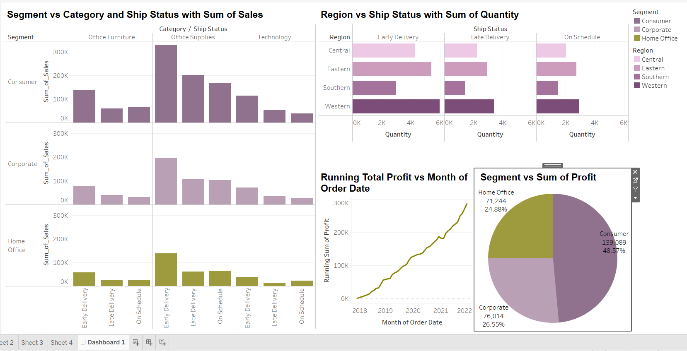
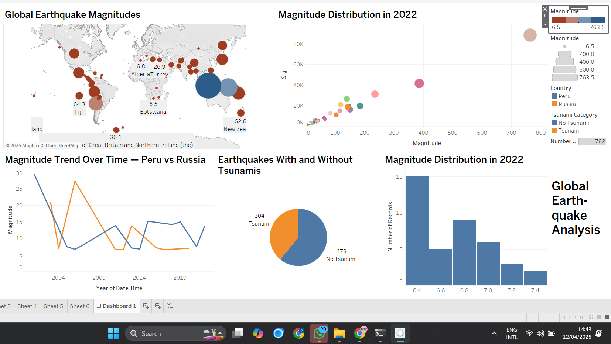

# 🚀 Accelerator Program Dashboard

> This dashboard provides insights into the performance and impact of the Accelerator Program, tracking KPIs such as participant growth, success rates, and geographic distribution.

# 🌍 Global Earthquake Analysis Dashboard

> This dashboard presents a global overview of earthquake events, analyzing magnitude, frequency, depth, and geographic distribution over time.

